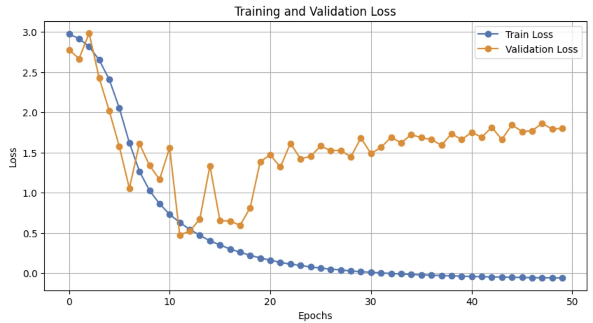
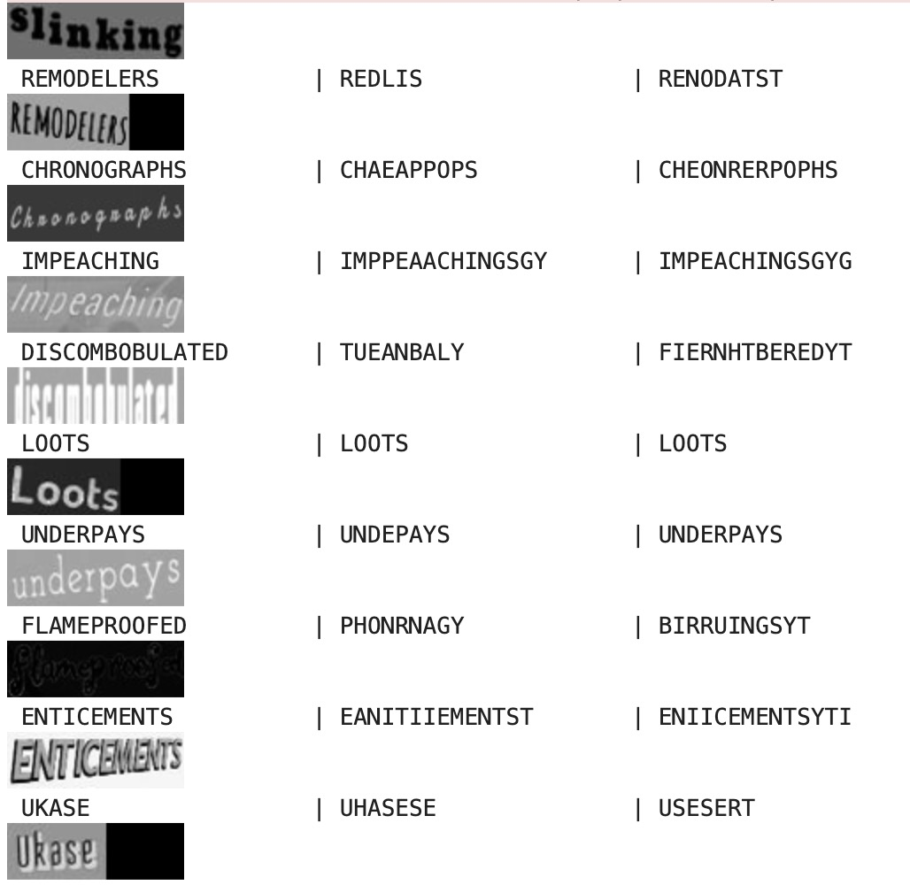
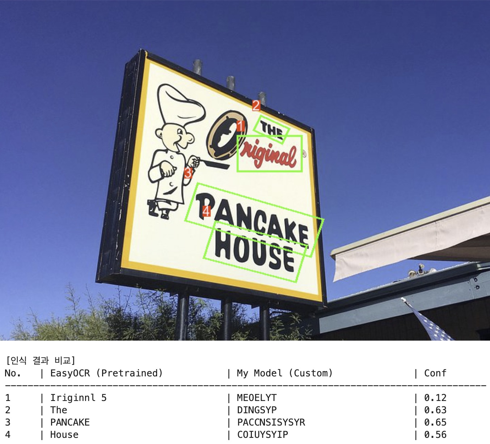
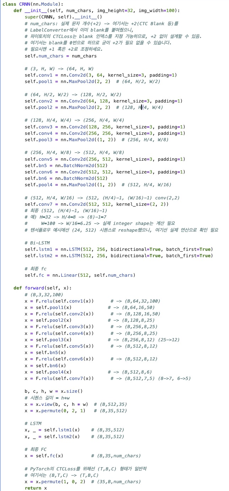
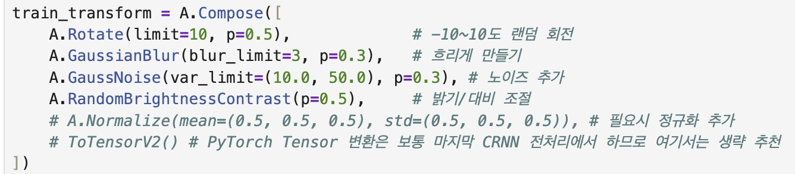
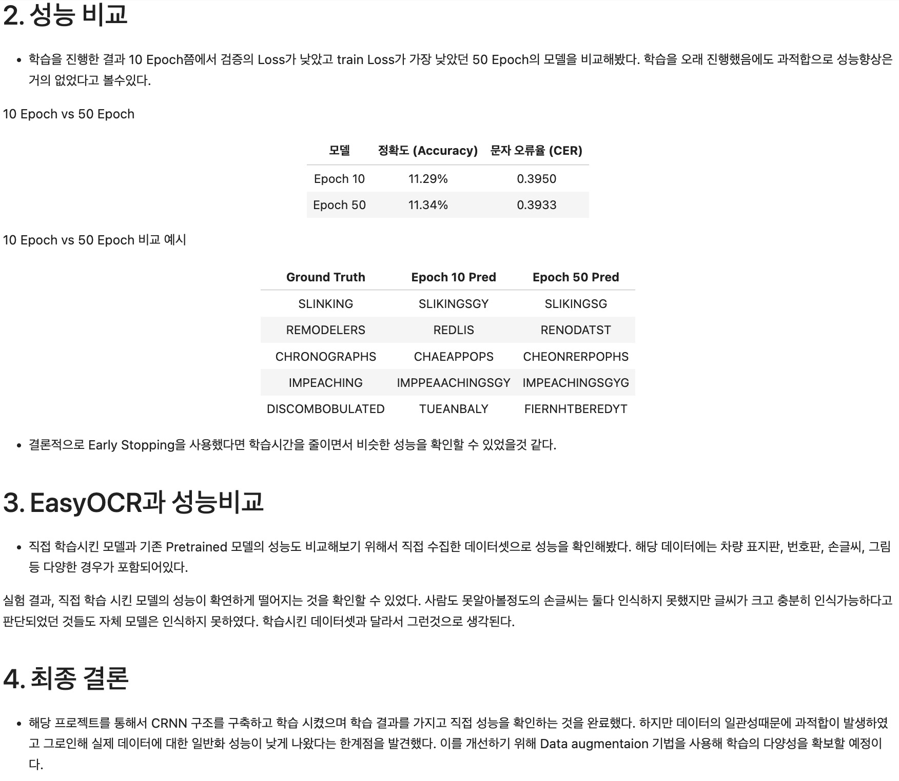

# AIFFEL Campus Online Code Peer Review Templete
- 코더 : 최재훈
- 리뷰어 : 오학균


# PRT(Peer Review Template)
- [ ]  **1. 주어진 문제를 해결하는 완성된 코드가 제출되었나요?**
    - 
    - 
    - 
    - 전체적으로 문제를 해결하기 위한 프로세스로 되어있다.
    - 실제 이미지를 가져와서, 사전학습된 모델과 비교를 하며 어떤지 파악도 진행했다.
    - loss가 음수를 띄운건 의아하다. 
    
- [ ]  **2. 전체 코드에서 가장 핵심적이거나 가장 복잡하고 이해하기 어려운 부분에 작성된 
주석 또는 doc string을 보고 해당 코드가 잘 이해되었나요?**
    - 
    - 아무래도 우리가 배우고 써먹을 모델이 핵심으로 보였다.
    - 단순한 모델이지만, 차원 연결을 잘해야하다 보니 잘 작성이 되어있었다.
        
- [ ]  **3. 에러가 난 부분을 디버깅하여 문제를 해결한 기록을 남겼거나
새로운 시도 또는 추가 실험을 수행해봤나요?**
    - 
    - 데이터 증강으로 시도를 해보았다.
        
- [ ]  **4. 회고를 잘 작성했나요?**
    - 
    - 성능비교와 왜 그랬는지 고민을 한 흔적이 있다.
        
- [ ]  **5. 코드가 간결하고 효율적인가요?**
    - 전체적으로 함수화를 잘 해놓았다.


# 회고(참고 링크 및 코드 개선)
```
실제 이미지로 진행을 하질 않고 시간이 다 되었어서, 차후에 이렇게 진행을 해봐야겠다.
```
상진님 지금 merge해봤는데, 1번 이미지는 보이는데 나머지 이미지들은 "alt text"라고 떠서 안보이네요